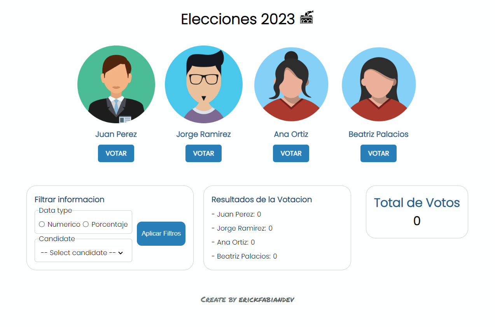
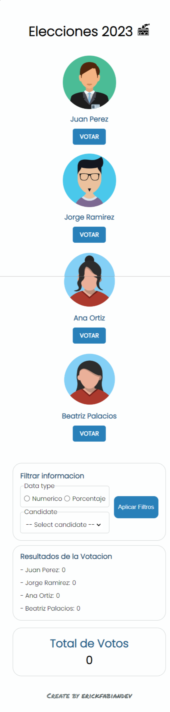

# Project Name: User Voting System 🚀  
## Table of contents :page_facing_up:
- [Overview](#overview)
  - [Installation](#Installation)  
  - [The challenge](#the-challenge)
  - [Screenshot](#screenshot)
- [My process](#my-process)
  - [Built with](#built-with)
  - [What I learned](#what-i-learned)
  - [Continued development](#continued-development)
  - [Useful resources](#useful-resources)
- [Authors](#authors)

## Overview :writing_hand:
This project is a user voting system that allows users to save their votes, view the results of all votes, and apply filters to the information. It has been developed using React, Sass, and the concept of React Context.

Deployed APP link : https://vote-count-eta.vercel.app/

### Installation :gear:
To get started with the project, follow these steps:

1. Clone the repository:
```shell
git clone https://github.com/erickfabiandev/vote-count.git
  ```
2. Navigate to the project directory:
```shell
cd vote-count
 ```
3. Install the dependencies: 
```shell
 npm install
 ```
4. Start the application: 
```shell
 npm run dev
  ```
The application will automatically open in your default web browser, ready for exploration.

### The Challenge :weight_lifting_man:
The main challenge of this project was to create a voting system that allowed users to store their votes and display the aggregated results in real-time. Additionally, implementing the filtering functionality posed its own set of challenges.

### Screenshot 📷 
Here is a screenshot of the project's interface:

***desktop view***


***mobile view***




## My Process :mountain:

1.  **Planning:** I began by defining the requirements and functionalities of the voting system. I also created a basic wireframe to outline the user interface.

2.  **Setting Up React Context:** To manage the application's state efficiently, I utilized React Context, which allowed me to pass data through the component tree without the need for props drilling.

3.  **Implementing Voting Logic:** I designed the voting mechanism, ensuring that users could submit their votes and that the system accurately stored and updated the data.

4.  **Creating Filters:** Next, I worked on adding filtering options to enable users to view specific subsets of voting results based on different criteria.

5.  **Styling with Sass:** Using Sass, I organized my stylesheets and applied a consistent and visually appealing design to the user interface.

6.  **Testing and Debugging:** I thoroughly tested the application to identify and fix any potential bugs or issues

### Built With :hammer_and_wrench:
The project was built using the following technologies:

* React
* Sass
* Javascript
* Figma
* Cloudinary

### What I Learned :microscope:
During the development of this project, I gained valuable experience in the following areas:

* Utilizing React Context for efficient state management.
* Building a user voting system with dynamic data handling.
* Implementing filtering functionality to manipulate data presentation.
* Organizing styles and improving the visual aspect of the application with Sass.

### Continued Development :briefcase:
While the current version of the user voting system meets the specified requirements, there are several areas where it could be further enhanced:

* Implementing user authentication to enable individual user voting.
* Adding data visualization tools like charts or graphs to display voting results more effectively.
* Optimizing performance for larger datasets.

### Useful Resources :sos:
During the development of this project, the following resources were helpful:

* Official React documentation: https://reactjs.org/docs
* Official Sass documentation: https://sass-lang.com/documentation
* React context documentation: https://legacy.reactjs.org/docs/context.html
* React Icons: https://react-icons.github.io/react-icons/

## Author :nerd_face:

This project created by erickfabiandev.
- [erickfabiandev](https:erickfabiandev.com)
